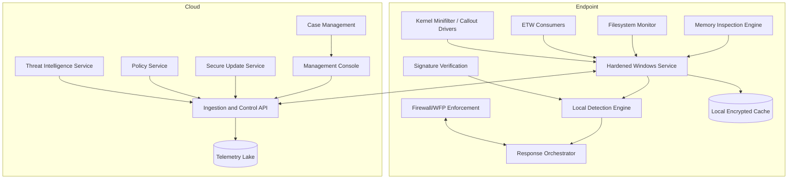

# Development Roadmap: Production-Grade AI Endpoint Security Platform

## Vision

Evolve Computer Immune System from a Python prototype into a production-grade AI endpoint security platform that combines low-level endpoint telemetry, deterministic policy enforcement, machine-learning detection, threat intelligence, safe response automation, and centralized fleet management.

The roadmap assumes a Windows-first commercial endpoint agent while preserving future Linux/macOS expansion paths. Each phase lists priority, complexity, primary deliverables, security goals, and exit criteria.

## Guiding principles

1. **Safety before autonomy** - automated response must be staged, reversible where possible, and governed by policy.
2. **Kernel/user separation** - kernel components collect/enforce only what must be kernel-level; complex logic remains in hardened user-mode services.
3. **Tamper resistance** - policies, models, updates, logs, and agent binaries must be authenticated and integrity-checked.
4. **Explainable detection** - AI results must be paired with evidence, rules, lineage, and confidence metadata.
5. **Fleet-first operations** - every local capability needs remote policy, telemetry, audit, rollback, and health visibility.
6. **Privacy by design** - redact sensitive telemetry, minimize collection, and enforce retention controls.

## Target production architecture

## Core subsystem roadmap

### Kernel driver architecture

**Goal:** collect high-fidelity telemetry and enforce limited containment while minimizing kernel attack surface.

- Windows minifilter driver for file create/write/rename/delete telemetry and optional blocking.
- Windows Filtering Platform (WFP) callout driver for process-aware network containment.
- Kernel-to-user event channel using bounded queues and backpressure.
- Strict driver signing, HLK testing, crash dump analysis, and fuzzing.
- Kernel policy cache limited to deterministic allow/block decisions; no ML in kernel.

**Priority:** Critical  
**Complexity:** Very High  
**Primary risks:** BSODs, performance regression, privilege escalation from driver bugs, signing/distribution overhead.

### ETW integration

**Goal:** consume native Windows event streams for process, image load, PowerShell, AMSI, DNS, network, registry, and security events.

- ETW session manager inside the Windows service.
- Providers: Kernel Process, Kernel ImageLoad, DNS Client, Microsoft-Windows-PowerShell, AMSI where available, Security Auditing, Defender where available.
- Event normalization into a common schema with monotonic timestamps and process lineage.
- Drop detection, queue metrics, and degraded-mode alerts.

**Priority:** Critical  
**Complexity:** High  
**Primary risks:** event loss under load, provider availability differences, privacy-sensitive script content.

### Windows service architecture

**Goal:** replace direct script execution with a hardened, observable, auto-updating service.

- Windows Service running as LocalService or a dedicated least-privilege account where possible.
- Privileged broker process only for actions requiring elevation.
- Service recovery options, watchdog, health endpoint, structured local logs.
- Protected configuration directory with ACL hardening.
- Local gRPC/named-pipe API with authenticated admin tooling.

**Priority:** Critical  
**Complexity:** High

### Real-time filesystem monitoring

**Goal:** detect and respond to file-based persistence, ransomware, suspicious modifications, and quarantined artifacts.

- Minifilter telemetry for high-integrity collection.
- User-mode fallback using ReadDirectoryChangesW for environments without driver support.
- Ransomware heuristics: burst renames, entropy shifts, extension fan-out, shadow-copy deletion indicators.
- File reputation: hash, signer, origin zone, prevalence, first-seen timestamp.
- Safe quarantine with transactional metadata and rollback.

**Priority:** High  
**Complexity:** High

### Memory inspection engine

**Goal:** detect process injection, reflective loading, credential theft tooling, and memory-resident malware.

- User-mode scanner for suspicious VAD regions, RWX pages, unsigned executable memory, anomalous module mappings.
- Optional kernel-assisted handle and memory metadata collection.
- YARA-compatible memory rules with CPU/time budgets.
- LSASS and protected-process safeguards; no unsafe reads from protected processes without approved capability.
- Evidence snapshots with privacy and legal controls.

**Priority:** High  
**Complexity:** Very High

### Network firewall integration

**Goal:** provide reversible, process-aware network containment.

- Windows Filtering Platform rules scoped by process, user, remote IP/domain, port, and direction.
- DNS sinkhole/block integration for malicious domains.
- Quarantine mode: allow management channel, block untrusted outbound/inbound.
- Transactional rule application with rollback journal.
- Metrics for blocked flows and policy conflicts.

**Priority:** High  
**Complexity:** High

### Threat intelligence feeds

**Goal:** enrich local decisions with curated, signed, and freshness-aware intelligence.

- Feed types: file hashes, signer reputation, domains, IPs, URLs, mutexes, registry keys, YARA/Sigma-like rules, LOLBin abuse patterns.
- Signed feed bundles with versioning, TTLs, priority, source confidence, and revocation.
- Local cache for offline operation.
- Collision and false-positive review workflow.

**Priority:** High  
**Complexity:** Medium-High

### Digital signature verification

**Goal:** distinguish trusted, unsigned, invalidly signed, revoked, or suspiciously signed binaries.

- Authenticode verification on Windows with chain validation and timestamp checks.
- Revocation handling with OCSP/CRL caching and offline behavior policy.
- Publisher allow/deny policy with certificate pinning for critical software.
- Catalog signature support for Windows system files.
- Signature metadata as model and policy features.

**Priority:** Critical  
**Complexity:** Medium-High

### Adaptive immune intelligence

**Goal:** transform Phase 5 immune memory into safe, analyst-guided adaptive detection intelligence without automatically changing enforcement policy.

- New additive `adaptive_intelligence` package with modular architecture descriptors, pattern learning, analyst feedback, recommendation generation, and assessment orchestration.
- Compare candidate incidents and behavior fingerprints against immune memory to produce adaptive scores, confidence, recurrence context, and explainable reasons.
- Aggregate repeated attack patterns into learned patterns that can inform later model tuning, triage prioritization, and policy review.
- Keep recommendations non-mutating by default; generated allowlist/blocklist candidates require explicit human or future signed-policy approval.
- Preserve Phase 1-5 runtime behavior and dry-run response safety while creating extension points for future model governance.

**Priority:** High
**Complexity:** Medium-High
**Primary risks:** feedback poisoning, overfitting to local incidents, false-confidence amplification, policy drift without governance.

### Secure update system

**Goal:** safely deliver agent binaries, drivers, policies, models, and threat intelligence.

- Signed update manifests with rollback protection and staged rollout rings.
- Delta update support with full-package fallback.
- Driver update safety gates and reboot coordination.
- Canary deployments, health-based rollback, and emergency kill-switch policies.
- Offline update packages for restricted networks.

**Priority:** Critical  
**Complexity:** High

### Cloud management console

**Goal:** manage endpoints, policies, detections, investigations, and response at fleet scale.

- RBAC, tenant isolation, SSO/SAML/OIDC, audit logs.
- Endpoint inventory, health, policy status, version compliance.
- Alert triage, case management, evidence bundles, timeline views.
- Policy editor with validation and staged deployment.
- Metrics dashboards for detection efficacy, false positives, and performance.

**Priority:** High  
**Complexity:** Very High

### Agent-to-server communication

**Goal:** provide secure, resilient control and telemetry transport.

- Mutual TLS with device identity and certificate rotation.
- Backpressure-aware telemetry batching and compression.
- Offline queue with disk quotas and priority shedding.
- Server-issued commands with signed authorization and local safety validation.
- Replay protection, monotonic sequence numbers, and clock-skew handling.

**Priority:** Critical  
**Complexity:** High

### Multi-endpoint management

**Goal:** support enterprise fleet operations across thousands to millions of endpoints.

- Groups, tags, dynamic collections, policy inheritance, and exceptions.
- Deployment rings: dev, pilot, broad, critical servers.
- Cross-endpoint correlation for campaigns and lateral movement.
- Global search over processes, files, hashes, users, hosts, and network indicators.
- API integrations with SIEM/SOAR, ticketing, and identity platforms.

**Priority:** High  
**Complexity:** Very High

## Performance targets

| Area | v1-v3 target | v4-v7 target | v8-v10 target |
| --- | ---: | ---: | ---: |
| Idle CPU overhead | < 3% average | < 1.5% average | < 1% average |
| Active scan CPU budget | Configurable, default < 20% one core | < 10% one core | Adaptive per device role |
| Idle memory overhead | < 250 MB | < 180 MB | < 120 MB |
| Kernel event loss | N/A/prototype | < 0.1% under normal load | < 0.01% with backpressure visibility |
| Event-to-detection latency | < 30 seconds | < 5 seconds | < 1 second for critical signals |
| Network containment latency | Manual/dry-run | < 5 seconds | < 1 second |
| Policy update propagation | Manual | < 15 minutes fleet-wide | < 2 minutes for emergency policy |
| Offline telemetry queue | Best effort | 24 hours capped | 7 days priority-tiered |
| False positive rate | Measured only | < 5% alert review FP | < 1% high-severity FP |
| Agent crash rate | Not measured | < 0.5% endpoints/month | < 0.1% endpoints/month |

## Milestones: v1 to v10

| Version | Theme | Priority | Complexity | Key deliverables | Exit criteria |
| --- | --- | --- | --- | --- | --- |
| v1 | Prototype stabilization | Critical | Medium | Clean package layout, config schema validation, structured logs, expanded unit tests, local SQLite migrations, safer dry-run defaults | Local scans are deterministic, test coverage covers critical modules, CLI is documented |
| v2 | Windows service MVP | Critical | High | Hardened Windows service wrapper, installer/uninstaller, ACL-protected config/log directories, health checks, local admin CLI | Agent runs as a service on Windows test hosts with recoverable failures |
| v3 | ETW telemetry foundation | Critical | High | ETW process/image/network/DNS/PowerShell consumers, normalized event schema, process ancestry graph, event queue metrics | Detects process starts and script activity in near real time with measured event loss |
| v4 | Policy and signer enforcement | Critical | Medium-High | Authenticode verification, publisher policy, signed policy bundles, policy linting, response-suppressing allowlist anchors | Unsigned/mis-signed binaries affect scoring; unsafe policies are rejected before deployment |
| v5 | Filesystem and ransomware defense | High | High | Minifilter prototype, user-mode fallback, file reputation, ransomware burst heuristics, transactional quarantine/restore | Simulated ransomware is detected and contained in lab without data loss |
| v6 | Adaptive immune intelligence + network containment | High | High | Local adaptive_intelligence package, immune-memory similarity, analyst feedback, explainable policy recommendations, WFP process-aware firewall integration, DNS blocking, quarantine network profile, rollback journal | Endpoint can learn from repeated attack patterns, recommend policy changes without auto-applying them, and isolate suspicious processes while preserving management connectivity |
| v7 | Secure updates and threat intelligence | Critical | High | Signed update manifests, staged rollout rings, signed TI feed bundles, offline cache, rollback | Agents update safely across pilot fleet and consume signed feeds with TTLs |
| v8 | Memory inspection and advanced detections | High | Very High | VAD/RWX/module anomaly scanner, YARA memory rules, injection heuristics, evidence capture controls | Common injection and reflective-loading simulations generate high-confidence alerts |
| v9 | Cloud management console | High | Very High | Multi-tenant console, RBAC, endpoint inventory, policy deployment, case management, SIEM/SOAR APIs | Operators can manage a pilot fleet and investigate alerts centrally |
| v10 | Enterprise-scale autonomous defense | Critical | Very High | Cross-endpoint correlation, model governance, drift monitoring, staged autonomous response, tamper-evident audit, SLA dashboards | Production pilot meets performance, reliability, false-positive, and rollback targets |

## Phase priority and complexity summary

| Phase | Priority | Complexity | Rationale |
| --- | --- | --- | --- |
| Service hardening and config validation | Critical | Medium-High | Required before any enforcement mode |
| ETW integration | Critical | High | Essential Windows telemetry source and lower risk than starting with kernel drivers |
| Digital signature verification | Critical | Medium-High | Major false-positive reducer and policy anchor |
| Secure update system | Critical | High | Required for safe model/policy/driver evolution |
| Kernel minifilter and WFP drivers | High-Critical | Very High | Needed for complete telemetry/enforcement but high operational risk |
| Filesystem/ransomware monitoring | High | High | High customer value and measurable lab validation |
| Memory inspection | High | Very High | Powerful but complex and sensitive to stability/privacy constraints |
| Threat intelligence feeds | High | Medium-High | Improves detection quickly if signing and FP workflows exist |
| Adaptive immune intelligence | High | Medium-High | Converts local immune memory into recurrence-aware triage and analyst-reviewed policy recommendations |
| Cloud console and fleet management | High | Very High | Required for enterprise adoption and multi-endpoint workflows |

## Dependencies and sequencing

1. **Do first:** service architecture, schema validation, signed config/policy, structured telemetry schema.
2. **Then:** ETW telemetry, signature verification, process ancestry, improved local detections.
3. **Then:** immune memory, adaptive intelligence, analyst feedback, and recommendation review workflows.
4. **Then:** secure update system and signed threat intelligence feeds.
5. **Then:** filesystem and network enforcement with rollback.
6. **Then:** memory inspection and kernel driver expansion after fuzzing and performance harnesses exist.
7. **Finally:** large-scale cloud console, cross-endpoint correlation, and autonomous response governance.

## Engineering quality gates

- Unit, integration, stress, fuzz, and adversarial test suites for every enforcement component.
- Performance benchmark suite run on developer workstations, low-end laptops, servers, and VDI-like hosts.
- Security review for every privileged boundary and update mechanism.
- Privacy review for every new telemetry field.
- Rollback test for every response and update action.
- Release gates for crash-free rate, event-loss rate, false-positive rate, and containment latency.
