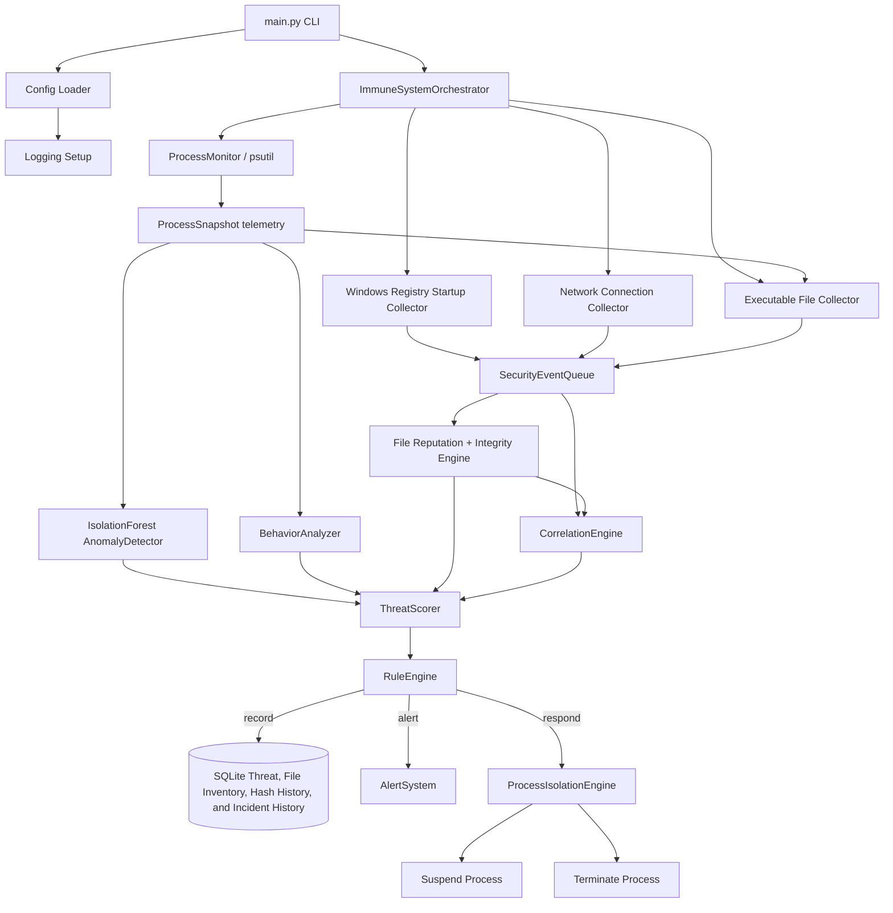
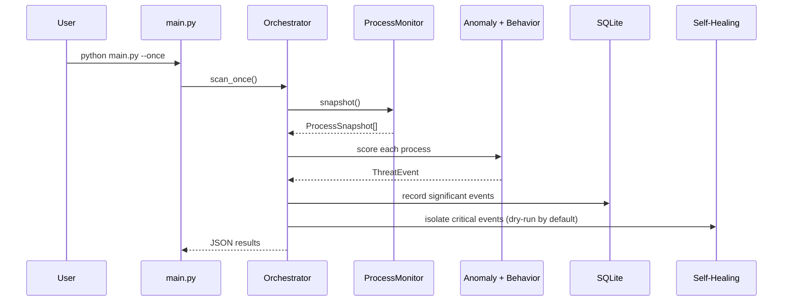

# Computer Immune System

Computer Immune System is a local, AI-assisted endpoint defense prototype. It monitors running processes, extracts behavioral telemetry, scores threats with a mix of machine-learning anomaly detection and transparent heuristics, stores threat history in SQLite, and can self-heal by isolating suspicious processes.

> Safety guarantee: response actions are centrally forced into `dry_run` mode in the current prototype, even if an override requests enforcement.

## Architecture





## Repository layout

- `main.py` - command-line entry point.
- `config/default_config.json` - default runtime configuration.
- `core/` - orchestration, rules, alerts, config, and logging setup.
- `monitor/` - process, network, file, and registry monitoring helpers.
- `detection/` - anomaly detection, behavior analysis, signatures, and model compatibility wrappers.
- `adaptive/` - threat scoring and adaptive helper utilities.
- `database/` - SQLite schema and threat-history repository.
- `response/` - response primitives such as process termination, quarantine, and network blocking abstractions.
- `self_healing/` - isolation, file repair, service restart, and snapshot restore helpers.
- `tests/` - unit tests for configuration, detection, scoring, database, and response behavior.

## Installation

```bash
python -m venv .venv
source .venv/bin/activate
pip install -r requirements.txt
```

## Usage

Run a single scan:

```bash
python main.py --once
```

Run continuously with periodic full scans:

```bash
python main.py
```

Run queue-driven real-time process and filesystem monitoring:

```bash
python main.py --realtime
```

On Windows, dispatch the Windows Service wrapper after installing optional Windows dependencies:

```bash
python main.py --windows-service status
```

Show recent threat history:

```bash
python main.py --history 20
```

Use an override config:

```bash
python main.py --config ./my-config.json --once
```

Example override:

```json
{
  "response": {
    "dry_run": false,
    "isolate_score_threshold": 90,
    "terminate_score_threshold": 98
  },
  "logging": {
    "level": "DEBUG",
    "file": "logs/immune_system.log"
  }
}
```


## Phase v2 real-time architecture

Phase v2 adds a bounded `SecurityEventQueue` between telemetry collectors and detection. Process lifecycle events, filesystem events, and Windows ETW events are normalized as security events before the orchestrator evaluates relevant process snapshots. ETW and filesystem monitoring are disabled by default in `config/default_config.json`; enable them gradually while keeping `response.dry_run` set to `true`.

- Process collector: emits `process.started`, `process.changed`, and `process.stopped`.
- Filesystem collector: uses `watchdog` and emits `file.*` events for configured watch paths.
- Windows ETW collector: validates platform and pywin32 availability, publishes normalized `etw.event` records, and provides a facade for Windows provider integration.
- Windows Service wrapper: `service_windows.py` supports pywin32 service dispatch and foreground debugging.

See [`MIGRATION_NOTES.md`](MIGRATION_NOTES.md) before enabling Phase v2 collectors.


## Phase 3 visibility expansion

Phase 3 adds endpoint visibility beyond process snapshots:

- **Windows startup registry monitoring** watches common `Run` and `RunOnce` persistence locations and emits `registry.startup_value_*` events when startup values are created, modified, or deleted. The collector is platform-safe and only reads Windows registry data on Windows.
- **Network telemetry** uses `psutil.net_connections(kind="inet")` snapshots to emit `network.connection_opened` events, including PID, local/remote addresses, ports, status, and whether a configured dangerous port was observed.
- **Correlation engine** links process, registry, and network events into attack-chain incidents such as `registry_persistence`, `suspicious_network_connection`, and `process_persistence_network_chain`.
- **SQLite persistence** now stores `registry_events`, `network_events`, and `correlated_incidents` in addition to process threat history. Existing databases are migrated by creating the new tables without changing existing threat rows.

All Phase 3 collectors are disabled by default for backward compatibility. Enable them gradually in a config override while keeping `response.dry_run` enabled/forced:

```json
{
  "registry": {"enabled": true},
  "network": {"enabled": true, "seed_baseline": true},
  "correlation": {"window_seconds": 300}
}
```

## Phase 4 file reputation and integrity

Phase 4 inventories executable files associated with process snapshots and adds transparent file reputation signals to process threat scoring. The executable collector records the resolved path, size, platform creation/change timestamp, modification timestamp, SHA-256 digest, process identity, and digital-signature status. On Windows, signature status is obtained through Authenticode using a non-shell PowerShell invocation; other platforms report `unknown` rather than treating unverifiable files as unsigned.

Reputation scoring considers:

- unsigned or invalidly signed executables;
- execution from `temp`/`tmp` directories;
- execution from a user `Downloads` directory;
- executables not previously present in local inventory;
- SHA-256 changes for a previously observed path; and
- configurable suspicious filename patterns.

A hash transition emits `file.integrity_change`, stores both hashes in `file_hash_history`, and contributes to correlation. A new or modified executable combined with startup registry persistence and a suspicious network connection creates a critical `file_persistence_network_attack_chain` incident. File signals can be stored and alerted on, but cannot directly activate response actions.

Default configuration:

```json
{
  "file_monitor": {
    "enabled": true,
    "hash_algorithm": "sha256",
    "track_hash_changes": true,
    "monitor_temp_execution": true
  }
}
```

Hashing has an I/O cost. Executable paths are deduplicated within each process scan, and the collector rejects observations when a file changes while it is being hashed. Existing override files do not need a `file_monitor` section; direct legacy configurations without it leave Phase 4 disabled. Existing SQLite databases are upgraded in place with `file_inventory`, `file_hash_history`, and `file_reputation_events`.

## Detection model

The anomaly detector uses `sklearn.ensemble.IsolationForest` when enough process samples exist. In small environments it falls back to deterministic z-score scoring so the engine still works in tests, containers, and low-process-count hosts.

Threat score inputs:

1. **Behavior score** - suspicious names, command-line patterns, dangerous ports, high resource usage, large connection count, large file-handle count, and high thread count.
2. **Anomaly score** - numeric outlier score from CPU, memory, thread, file, connection, port, and command-line-length features.
3. **File reputation score** - executable provenance, signature, location, novelty, filename, and integrity-change signals.
4. **Phase 3 signals** - registry persistence, suspicious network ports, and correlated attack chains.
5. **Severity** - informational, low, medium, high, or critical based on the bounded combined score.

## Policy engine

The policy engine supports allowlists, blocklists, and protected processes using process names, executable path globs, command-line patterns, and optional executable SHA-256 hashes. Protected and allowlisted processes suppress automated response to reduce false positives; blocklisted processes are raised to a configurable score floor.

`monitoring.hash_executables` is disabled by default because hashing every process executable can be expensive. Enable it only when hash policy is required.

## Self-healing behavior

`ProcessIsolationEngine` can suspend suspicious processes or terminate extremely risky processes. The default is dry-run, which logs intended actions without changing host state.

- `response.isolate_score_threshold` controls when isolation starts.
- `response.terminate_score_threshold` controls when termination is used instead of suspension.
- `response.dry_run` must be `false` for real enforcement.
- Response actions write a recovery journal to `data/recovery_journal.jsonl` by default. Suspended processes can be resumed during rollback when the PID create time still matches.

## Local data and logs

- Threat history: `data/threat_history.sqlite3` by default.
- Logs: `logs/immune_system.log` by default.

Both paths are configurable in `config/default_config.json` or an override config file.

## Development

Run tests:

```bash
python -m pytest
```

Run one scan in dry-run mode:

```bash
python main.py --once
```

## Windows compatibility

The process monitor and isolation workflow use `psutil`, which works on Windows, Linux, and macOS. Policy path matching normalizes path separators and case. Service restart uses `sc stop` / `sc start` on Windows, `launchctl` on macOS, and `systemctl` on Linux.

## Security review and production roadmap

See [`SECURITY_ARCHITECTURE_REVIEW.md`](SECURITY_ARCHITECTURE_REVIEW.md) for the detailed security review, remaining design risks, and phased production roadmap.
